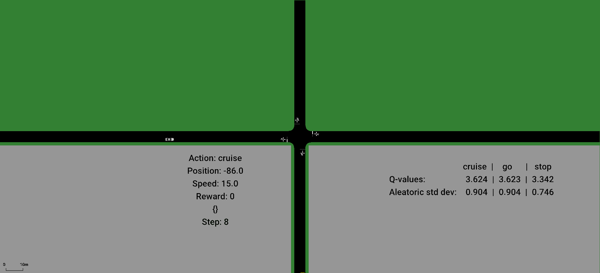
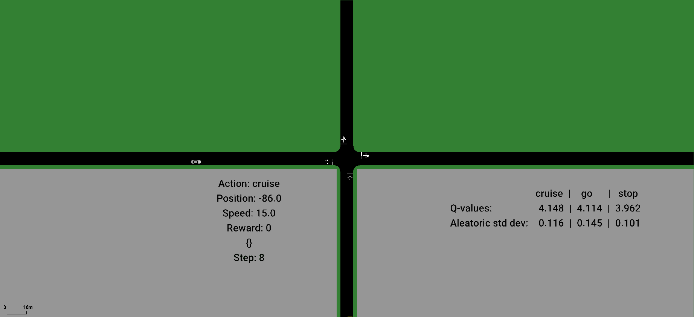
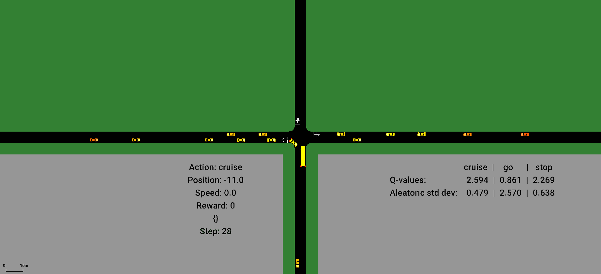
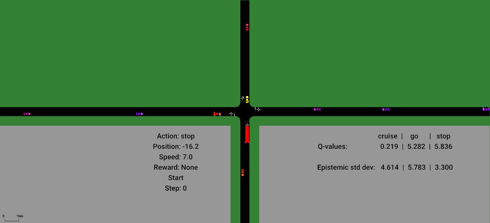

# Ensemble Quantile Networks: Uncertainty-Aware Reinforcement Learning with Applications in Autonomous Driving

This repo contains the code that was used in the paper [Ensemble Quantile Networks: Uncertainty-Aware Reinforcement Learning with Applications in Autonomous Driving](https://arxiv.org/abs/2105.10266). If this code is used, please cite the paper and the repo.

Animations of the trained agents are shown below, followed by a brief instruction on how to use the code.

---

## Videos

This section shows how the trained agents behave in a few test episodes with high aleatoric and epistemic uncertainty, respectively. The animations correspond to Figure 4, 7, and 9 in the paper.

The ego vehicle is the truck that is approaching the intersecion from the south, and the color of the ego vehicle depends on its current decision: green - go, yellow - cruise, red - stop, blue - safety policy. A description of the precise interpretation of the different actions is provided in the paper. Note that when the ego vehicle is standing still, the actions stop and cruise have the same effect, whereas at the maximum speed 15 m/s, the actions go and cruise have the same effect.

The gray areas represent occluding objects, such as buildings. The occluded vehicles are also displayed in gray, whereas observed vehicles are shown in color. The colors of the surrounding vehicles depend on their current speed, ranging from yellow to red, which corresponds to the interval 0 to 15 m/s.

The animations are also available as mp4 files in [videos/](videos/), if you would like to pause or step through the animations. If you want the gif:s below to start at the same time, just reload the page in your browser.

<br/>

### Fig. 4, aleatoric uncertainty

Both agents follow the same policy until time step 11. At this time, the risk-sensitive agent chooses to slow down to cross the intersection at a low speed, whereas the risk-neutral agent crosses the intersection at full speed, whích in this case causes a collision. Note the high estimated aleatoric uncertainty of the chosen actions for the risk-neutral agent from time step 11.

#### IQN, :


#### IQN, :


<br/>

### Fig. 7, aleatoric uncertainty

In this situation, the aleatoric uncertainty arises from the unknown intention of the vehicle that is approaching the intersection from the west, see the paper for more details. The agent that does not take aleatoric uncertainty into account selects the action go at time step 37, which causes a collision. Note that the estimated aleatoric uncertainty of this action is high. Therefore, the agent that restricts the allowed aleatoric uncertainty instead applies the backup policy at time step 37 and can thereby avoid the collision.

#### IQN, :


#### IQN, :


<br/>

### Fig. 9, epistemic uncertainty

In this situation, there is a high epistemic uncertainty due to the high speed of the vehicles that are approaching from the east. During the training phase, the agent was exposed to vehicles with speeds up to 15 m/s, whereas the vehicle that is involved in the collision is driving at 23 m/s. Note the high epistemic uncertainty at time step 1. The second agent therefore applies the backup policy and avoids the collision. Vehicles that are driving faster than 15 m/s are displayed in different shades of purple.

#### RPF, :


#### RPF, :


---

## Source code

#### Prerequisites

Python and Simulation of Urban Mobility ([SUMO](http://sumo.sourceforge.net/)), version 1.8 (something have changed in the interface in later versions, and I have not had the time to update the code).

Install SUMO from source (tested for ubuntu 18.04):

```shell
apt-get update
apt-get install -y git cmake python3.7 python3-pip g++ libxerces-c-dev libfox-1.6-dev libgdal-dev libproj-dev libgl2ps-dev graphviz
git clone --depth 1 --branch v1_8_0 https://github.com/eclipse/sumo
mkdir sumo/build/cmake-build
cd sumo/build/cmake-build
cmake ../..
make -j$(nproc)
make install
cd ../../..
rm -r sumo
export SUMO_HOME="/usr/local/share/sumo"
```

Install dependencies:

```shell
pip3 install -r requirements.txt
```

#### Docker

Using Docker makes it even easier to get started. From the top folder, simply build with [Dockerfile](Dockerfile):


```shell
docker build -t <name> -f Dockerfile .
```

#### Usage

The code is relatively well documented. The following steps help to get you started.

##### Training process

To start the training of the agent, from [src/](src/), run:

```shell
python3 train_agent.py <log_name>
```

The performance of the agent is regularly tested on a set of test episodes. Logs are saved in logs/, where among other things the following are saved:
- Rewards and number of steps of the test episodes
- Weights of the neural networks for the test episodes
- Tensorboard logs for both the training and test episodes.

The performance of the agent can be followed in tensorboard during the training process.


##### Parameters

The parameters of the agent are set in [parameters.py](src/parameters.py) and the parameters of the simulation environment are set in [parameters_intersection.py](src/parameters_intersection.py).


##### Visualize trained agent

The behavior of the trained agent can be observed in SUMO's GUI, both for the test episodes and for the special cases that are mentioned in the paper.

In [run_trained_agent.py](src/run_trained_agent.py), set *filepath* and *agent_name* to the agent you would like to test. Additional visualization options are available, see the description in the file. Then, from [src/](src/), run:

```shell
python3 run_trained_agent.py
```

An example of the output is shown below.


##### Tests

A number of tests are included to make sure that the code is working and all dependencies are fulfilled. From [tests/](tests/), run:

```shell
python3 -m unittest discover .
```

It will take around 30 minutes to run all tests. If successful, the system will provide the following output when the tests are done (the exact time will of course vary):
```shell
----------------------------------------------------------------------
Ran 81 tests in 1774.524s

OK
Error: tcpip::Socket::recvAndCheck @ recv: peer shutdown
Quitting (on error).
```

Note that if you receive this output, everything is working fine. The "error" above does not refer to an error in the tests, it's just an output from when disconnecting from SUMO.


## License

This code is released under the MIT license, see [LICENSE.md](LICENSE.md) for details.


## Contact

Just send an email if you have any questions, carl-johan.hoel@chalmers.se or cjhoel86@gmail.com.
